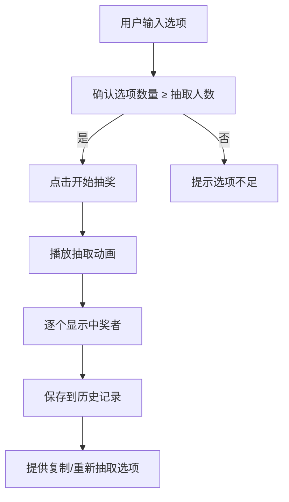

# 随机抽奖/抽签工具 PRD 文档

## 1. 产品概述

一个精美且功能完整的在线随机抽奖/抽签工具，帮助用户快速从多个选项中随机抽取中奖者或选择。支持自定义输入、灵活配置、流畅动画效果，适用于年会抽奖、课堂点名、活动选择等场景。

**核心价值：**
- 无需安装，浏览器即用
- 视觉美观，操作直观
- 支持自定义选项和抽取数量
- 即时显示结果，带有动画效果

**目标用户：**
- 企业活动组织者（年会、团建抽奖）
- 教师（课堂随机点名）
- 活动策划人员（抽奖环节）
- 普通用户（日常随机选择）

## 2. 核心功能

### 2.1 功能模块

1. **选项输入区域**
   - 文本输入模式：每行一个选项，支持批量粘贴
   - 预设模板：常见抽奖场景快速填充
   - 实时选项计数显示
   - 选项预览列表

2. **抽取配置区域**
   - 抽取人数设置：1人或多人
   - 抽取模式：普通抽取（不重复）、可重复抽取
   - 一键清空重置功能

3. **抽奖控制区域**
   - 开始/停止抽奖按钮
   - 抽奖动画效果
   - 进度提示

4. **结果展示区域**
   - 中奖者高亮展示
   - 抽取动画效果
   - 结果历史记录（本次会话）
   - 一键复制结果

5. **预设模板**
   - 年会抽奖（预设10-50人名单）
   - 课堂点名（预设班级场景）
   - 自定义选项

### 2.2 页面详情

| 页面名称 | 模块名称 | 功能描述 |
|---------|---------|---------|
| 主页 | 选项输入区 | 多行文本输入框，实时解析每行作为独立选项 |
| 主页 | 配置面板 | 抽取人数滑块/输入，模式选择开关 |
| 主页 | 抽奖按钮 | 大型圆形按钮，hover发光效果，点击触发动画 |
| 主页 | 结果展示区 | 卡片式展示中奖者，支持动画效果 |
| 主页 | 历史记录 | 侧边栏或折叠区域显示本次抽奖历史 |

## 3. 核心流程

### 3.1 抽奖流程

### 3.2 用户交互流程

1. **输入选项**
   - 用户在文本框中输入或粘贴选项（每行一个）
   - 系统实时解析并显示选项数量
   - 支持从预设模板快速加载

2. **配置参数**
   - 设置抽取人数（默认1人）
   - 选择是否允许重复抽取
   - 实时校验配置合法性

3. **执行抽奖**
   - 点击抽奖按钮启动
   - 界面展示滚动/翻转动画
   - 依次显示中奖结果
   - 提供结果复制功能

4. **结果操作**
   - 查看本次抽奖历史
   - 一键清空重新开始
   - 复制结果到剪贴板

## 4. 用户界面设计

### 4.1 设计风格

**视觉定位：现代喜庆风**
- 主色调：深紫/藏蓝色背景 (#1a1a2e, #16213e)
- 强调色：金色/琥珀色 (#f4d03f, #e6b800)
- 点缀色：玫红色 (#e056fd)、青色 (#00d9ff)
- 字体：思源黑体（中文）+ Poppins（英文数字）
- 按钮风格：圆角胶囊形，带阴影和光晕效果

**设计特点：**
- 卡片式布局，层次分明
- 渐变背景营造氛围感
- 微妙的玻璃态效果
- 大字体数字展示，突出结果
- 流畅的CSS动画过渡

### 4.2 页面设计概览

| 模块 | 布局 | 颜色 | 字体 | 动效 |
|-----|------|------|------|------|
| 顶部标题区 | 居中 | 金色渐变文字 | 大号衬线字体 | 无 |
| 输入区 | 左对齐卡片 | 半透明深色背景 | 无衬线字体 | 聚焦时边框发光 |
| 配置区 | 水平排列 | 分隔线区分 | 中号字体 | 开关滑动过渡 |
| 抽奖按钮 | 居中突出 | 金色渐变+光晕 | 粗体大号 | hover放大+光晕增强，点击脉冲效果 |
| 结果区 | 网格/列表 | 玻璃态卡片 | 装饰性字体 | 翻转/缩放入场动画 |
| 历史区 | 底部折叠 | 与输入区统一风格 | 小号字体 | 平滑展开/收起 |

### 4.3 响应式设计

- **桌面优先** (≥1024px)：三栏或两栏布局
- **平板适配** (768px-1023px)：两栏布局，间距调整
- **手机适配** (<768px)：单栏垂直布局，触摸优化
- 按钮和输入框尺寸适配移动端
- 历史记录在移动端默认折叠

## 5. 边界情况处理

| 场景 | 处理方式 |
|-----|---------|
| 选项为空 | 禁用抽奖按钮，提示"请输入选项" |
| 选项不足 | 提示"选项数量少于抽取人数" |
| 抽取人数为0 | 自动设为1 |
| 重复选项 | 保留但标记颜色 |
| 超长选项文本 | 截断显示，hover显示完整 |
| 大量选项(>1000) | 分批处理，显示加载进度 |
