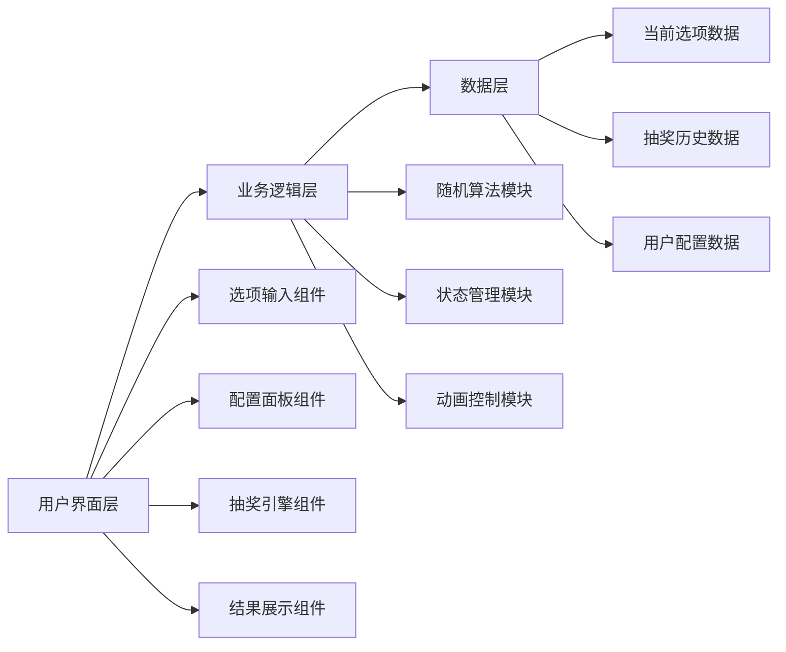

# 随机抽奖工具 技术架构文档

## 1. 架构设计



**架构说明：**
- 纯前端单页应用，无需后端服务器
- 所有数据存储在浏览器内存中
- 状态通过 React Hooks 管理
- GitHub Pages 静态部署

## 2. 技术选型

**前端框架：**
- React 18（CDN引入，JSX语法）
- 单HTML文件，内联CSS和JavaScript

**样式方案：**
- CSS3 变量管理主题色
- CSS Grid + Flexbox 布局
- CSS 动画（keyframes）实现抽奖效果

**随机算法：**
- Fisher-Yates 洗牌算法确保公平性
- requestAnimationFrame 控制动画帧率

**第三方库（CDN）：**
- React 18.2.0
- ReactDOM 18.2.0
- Babel Standalone（浏览器端JSX编译）

## 3. 路由定义

单页应用，无路由概念。

```
/
└── 主页（包含所有功能模块）
```

## 4. 组件结构

```
App
├── Header（标题区域）
├── OptionInput（选项输入区）
│   ├── TextArea（文本输入）
│   ├── TemplateSelector（模板选择）
│   └── OptionCounter（选项计数）
├── ConfigPanel（配置面板）
│   ├── CountSelector（抽取人数）
│   └── ModeToggle（模式切换）
├── LotteryButton（抽奖按钮）
├── ResultDisplay（结果展示）
│   ├── ResultCard（单个结果卡片）
│   └── AnimationLayer（动画层）
└── HistoryPanel（历史记录）
    └── HistoryList（历史列表）
```

## 5. 状态管理

### 5.1 React State 结构

```typescript
interface AppState {
  options: string[];                    // 当前选项列表
  winnerCount: number;                  // 抽取人数
  allowDuplicates: boolean;             // 是否允许重复
  winners: string[];                    // 当前中奖者
  history: string[][];                  // 抽奖历史记录
  isAnimating: boolean;                 // 是否正在抽奖
  currentAnimationIndex: number;        // 当前动画索引
}
```

### 5.2 状态更新流程

1. **输入更新**：`options` → 实时解析文本输入
2. **配置更新**：`winnerCount`, `allowDuplicates`
3. **抽奖开始**：`isAnimating: true` → 触发动画
4. **抽奖完成**：`winners` 更新 → `history` 添加记录 → `isAnimating: false`

## 6. 核心算法

### 6.1 随机抽取算法（Fisher-Yates）

```javascript
function shuffleArray(array) {
  const shuffled = [...array];
  for (let i = shuffled.length - 1; i > 0; i--) {
    const j = Math.floor(Math.random() * (i + 1));
    [shuffled[i], shuffled[j]] = [shuffled[j], shuffled[i]];
  }
  return shuffled;
}

function selectWinners(options, count) {
  const shuffled = shuffleArray(options);
  return shuffled.slice(0, count);
}
```

### 6.2 动画控制

- 使用 CSS `@keyframes` 实现翻转/滚动效果
- `setInterval` 控制中奖者逐个显示（间隔500ms）
- 动画结束回调触发状态更新

## 7. 性能考虑

1. **大量选项优化**：选项超过1000时使用虚拟滚动（简化版：分批渲染）
2. **动画性能**：使用 `transform` 和 `opacity` 实现动画，避免重排
3. **内存管理**：历史记录限制保存最近20条，超出自动清除旧记录

## 8. 部署方案

**目标平台：** GitHub Pages

**部署流程：**
1. 创建 GitHub 仓库
2. 推送代码到 `main` 分支
3. 启用 GitHub Pages（Settings → Pages → Source: main branch）
4. 等待部署完成（通常1-2分钟）
5. 通过 `https://[username].github.io/[repository-name]/` 访问

**文件结构：**
```
/
├── index.html          # 主页面（包含所有代码）
├── README.md           # 项目说明
└── .nojekyll           # 禁止 Jekyll 处理
```

## 9. 浏览器兼容性

- Chrome 80+
- Firefox 75+
- Safari 13+
- Edge 80+

**注意事项：**
- 使用 ES6+ 语法，配合 Babel 转译
- CSS 特性使用标准属性，回退方案通过 `@supports` 提供
